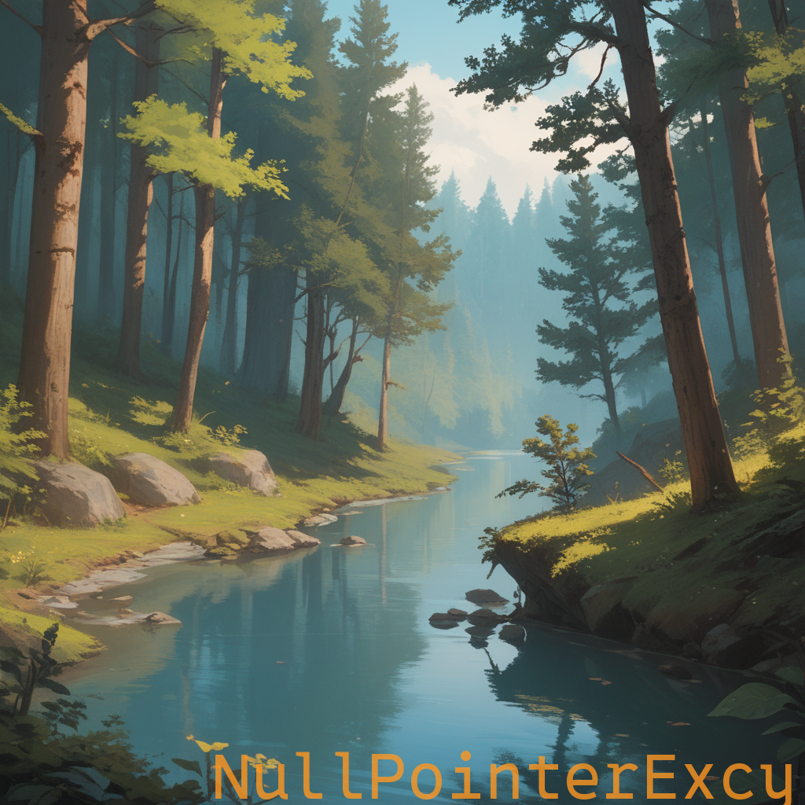

# BulkImageEditor

[](https://github.com/NullPointerExcy/BulkImageEditor/releases/latest)


A simple image processing tool for resizing images and adding text watermarks to them. Built using Python's `Pillow`
library, this tool can adjust image dimensions while maintaining aspect ratio and apply customizable text or image watermarks.

### UI Preview

<div align="center">
  
</div>

## Features

- **Resize Options**: Easily resize images to fit custom dimensions while maintaining aspect ratios.
- **Watermarking**:
  - **Text Watermarking**: Apply text-based watermarks with customizable fonts, size, position, color, and transparency.
  - **Image Watermarking**: Use an image file as a watermark and adjust transparency.
  - **Fill Option**: Choose to repeat the watermark across the entire image.
- **Color Picker**: Set custom watermark colors with a live preview box.
- **System Font Detection**: Automatic detection of system fonts for use in text-based watermarks.

## Results (Before and After)
**Note**: These images were generated by me using Stable Diffusion with a custom trained model.
### Text Watermarking (Bottom Right)
<div align="center">
  
  
</div>

### Image Watermarking (Bottom Right)
<div align="center">
  
  
</div>

### Text Watermarking (Tiled Fill)
<div align="center">
  
  
</div>

### Image Watermarking (Tiled Fill)
<div align="center">
  
  
</div>

## Requirements (If not using the `.exe`)

- Python 3.7 or higher
- Pillow (Python Imaging Library)

Install the required dependencies with:

```bash
pip install pillow
pip install matplotlib
```

## Usage

### Run the Executable
Download and execute the `.exe` file.

### Launch the UI from Command Line
To open the graphical interface using the command line:
```bash
py .\src\ui\bulk_image_editor_ui.py
```

### Run Main Script with Command Line Arguments
To process images directly from the command line, use:
```bash
py .\main.py --input_path path/to/input --output_path path/to/output [options]
```

### Arguments

| Argument          | Type    | Default             | Description                                                                                |
|-------------------|---------|---------------------|--------------------------------------------------------------------------------------------|
| --input_path      | str     | Required            | Path to the directory containing images to be processed.                                   |
| --output_path     | str     | Required            | Path to the directory where processed images will be saved.                                |
| --resize          | Flag    | False               | Enable resizing of images.                                                                 |
| --max_width       | int     | 800                 | Max width for resizing images (maintains aspect ratio).                                    |
| --max_height      | int     | 800                 | Max height for resizing images (maintains aspect ratio).                                   |
| --add_watermark   | Flag    | False               | Enable watermarking on images.                                                             |
| --watermark_text  | str     | "Sample Watermark"  | Text to use for watermarking. Ignored if --watermark_image is specified.                   |
| --watermark_image | str     | None                | Path to an image file for use as a watermark (overrides --watermark_text).                 |
| --position        | str     | "bottom-right"      | Position of the watermark. Options: top-left, top-right, bottom-left, bottom-right, center |
| --font_size       | int     | 40                  | Font size for text watermarking.                                                           |
| --font_family     | str     | "arial"             | Font family for the text watermark.                                                        |
| --text_color      | str     | "#ffffff"           | Hex color code for the text watermark.                                                     |
| --alpha           | float   | 0.5                 | Transparency level of the watermark (0 = fully transparent, 1 = opaque).                   |
| --fill            | Flag    | False               | Fill the entire image with the watermark (tiled effect).                                   |
                           
